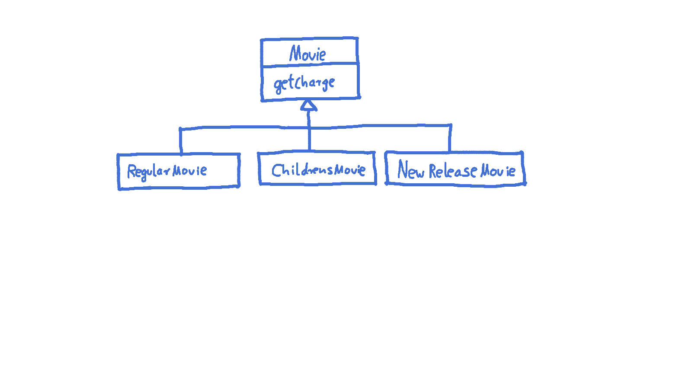

# Refactoring
## Book "Refactoring" by Martin Fowler
- one of __the__ sources for the topic
- "Refactoring is the process of changing a software system in such a way that it does not alter the external behavior of the code yet improves its internal structure. It is a disciplined way to clean up code that minimizes the chances of introducing bugs. In essence when you refactor you are improving the design of the code after it has been written."
- book written in 1999, when agile methods have not become that popular. Hence: improving existing code step by step new thing
- today: Refactoring = fundamental skill of every developer + part of many methods, such as TDD ("Red - Green - Refactor")
- Refactoring = part of developer's everyday life: first refactor, then add new functionality
- also: refactoring steps in book described in detail what today's IDEs can do automated. Some errors author made are impossible to do now, except when ignoring capabilities of IDEs and doing everything by hand.
 
## Simple Refactorings in Chapter 1
- Following examples from the book plus [tobyweston/Refactoring-Chapter-1](https://github.com/tobyweston/Refactoring-Chapter-1) (attention: some minor naming and syntax changes in comparison to the book)
- each commit is a refactoring from the book
- first step of refactoring: add a solid test base, for example via behavior tests (record given behavior of a method / class without thinking about what it really should do too much) - not done in the book however

### Refactoring: extract method
- switch-statement in class Customer ugly
- done with modern IDE: method gets extracted without problems with two parameters rental and amount
- because amount is set to 0 in for-loop, change it to return parameter 
- [extract method](https://github.com/tobyweston/Refactoring-Chapter-1/commit/8e249c8954d92aebabf304d875ac6f597977b307)

### Refactoring: Renaming
- (not covered in Github-repo)
- renaming = one of the 
    - most basic refactorings; very easy to do while just reading the code
    - hardest things to do in software development; always take your time to find a great name
 - very important to do with IDE support, even when just renaming a variable used a few lines below - errors will creep in!
- also: __don't__ rename using search + replace all. Use proper IDE functionality.
- antipatterns (especially in Java):
    - XYManager
    - XYUtil
    - XYHelper

### Refactoring: Move Method
- new method amountFor in Customer uses information from Rental, but not from Customer = encapsulation error
- IntelliJ IDEA proposes class Rental intelligently when "move method" refactoring is called 
- [move method](https://github.com/tobyweston/Refactoring-Chapter-1/commit/15c340ea73ac30b6fb41f607e6328ec48b87e849)

### Refactoring: Replace Temporary Variables with Query
- [Replace Temp with Query](https://github.com/tobyweston/Refactoring-Chapter-1/commit/98a38bcdb9b6eba987a31c939e5d04a9d13ad3de)

### Refactoring: extract method 
- [Extract method to isolate frequent renter points](https://github.com/tobyweston/Refactoring-Chapter-1/commit/74b34ba9ae870c6d5e4a5d0b8538dda043b77846)
- resulting method bad name: no getter!
- extracted method ugly, can be simplified. However: when refactoring, go step by step!
- simplification done in the [next step](https://github.com/tobyweston/Refactoring-Chapter-1/commit/8f9b81021aa71caf6f48c837e56eb135258a2d5f)

### Refactoring: replace temp with query
- [first step](https://github.com/tobyweston/Refactoring-Chapter-1/commit/9f57c1cea43af7742e76945c27535c1ab01437bc), [second step](https://github.com/tobyweston/Refactoring-Chapter-1/commit/a90a5ff957fb9064cd01377a1fcdb59866f0abda)
- possible issues with this refactoring:
    1. adds code => but improves readability. Always a good trade!
    1. goes through loop multiple times instead of just one time, so possible performance issue => don't optimize until profiled and proofed that this is really slow!

### Refactoring: extract and move methods to create consistent classes
- goal: less calls to other classes in calculations == move methods to where they belong
- [first step](https://github.com/tobyweston/Refactoring-Chapter-1/commit/69859dd14a232e00264afef3caa396988f0873cf)
- [second step](https://github.com/tobyweston/Refactoring-Chapter-1/commit/e69a71e29b7e1d556afd932c9264479a37c1a80f)     

### Refactoring: Introduce inheritance
- each type of movie (regular, children's, new release) has different price that is computed in Movie.getCharge()
- can be solved with subclasses: (new) classes RegularMovie, ChildrensMovie, NewReleaseMovie all extend class Movie
- BAD IDEA: movies will switch from NewReleaseMovie to some other category
- alternative: (new) classes RegularPrice, ChildrensPrice, NewReleasePrice all extend Price, which is used by Movie. That way, category of movie can be changed by simply switching to a new price.

  
- [create new price classes](https://github.com/tobyweston/Refactoring-Chapter-1/commit/a0d35118b90c8a2ec2a4dd601d2dd73f9ae727ad)
- [use new inheritance in calculation](https://github.com/tobyweston/Refactoring-Chapter-1/commit/c6e70880eae6c0867044b60e016ee0277fafcf8d)
- replace condition with inheritance: [1](https://github.com/tobyweston/Refactoring-Chapter-1/commit/4511529ce748aae80ee1cf2896bc581b991271a8), [2](https://github.com/tobyweston/Refactoring-Chapter-1/commit/445fd49c955d977f5225b8a0f6bfc48cbfd1c8c4)
- change can be viewed as a [state pattern](https://en.wikipedia.org/wiki/State_pattern) or a [strategy pattern](https://en.wikipedia.org/wiki/Strategy_pattern)

## Chapter 2: Principles in Refactoring
### General thoughts 
- refactoring != adding functions. You should be aware of which of these you are doing right now.
- refactoring ensures changeability
- the less code, the better
- most important aspect of code: should be readable because it gets read much more than it gets written
- also, refactoring can help understand unfamiliar code. Kind of "active reading".
- refactoring helps writing good code more quickly - on the long run! In the short run, it takes more time.
- Don't plan a "refactoring sprint", but refactor after every couple of commits, all the time!
- Refactoring code from others doesn't mean they are not able to write great code, just that you see things differently and can improve the code because of this outsiders position.
- hard decision: tell or don't tell the customer about refactoring issues? Depends.
- limitations to refactoring: change published interfaces which causes problems in code you can't reach with the refactoring. Can happen with simple refactorings like change method name. Solution: Keep old interface around for a while, mark it with @Deprecated (with a short explanation!). Don't copy method body, but let old implementation call the new one.
- refactoring and design: instead of big upfront-design, design thoughts should be made to a specific degree (upfront), but the rest should be done via refactoring. Do not find __the__ design solution, but __a__ reasonable one.
- very interesting story on page 58/59: about speculation in optimization of systems: "The lesson is: Even if you know exactly what is going on in your system, measure performance, don't speculate. You'll learn something, and nine times out of ten, it won't be that you were right!"     

## Sources
- Refactoring - Improving the design of existing code. Martin Fowler, Kent Beck

## TODO
- read and add "Refactoring"
- add content from "Refactoring to Patterns"